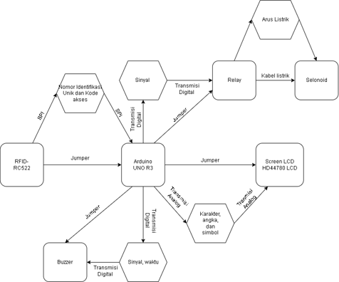
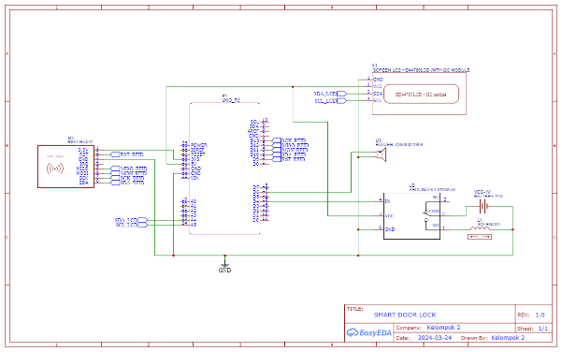
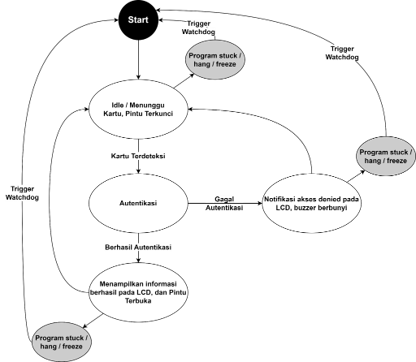

# Smart Door Lock — RFID-Based Embedded System

An embedded smart door lock system that uses **RFID-based authentication** to control access to a door. The system is built around an **Arduino UNO R3** and integrates an **MFRC522 RFID reader, solenoid door lock, relay, LCD 16×2, and buzzer** for access control and user feedback.

The system verifies the unique ID of an RFID card and determines whether access should be granted or denied. Authorized users can unlock the door, while unauthorized cards are rejected. The system also implements **Watchdog Timer** and **low-power optimization** to improve reliability and power efficiency.

<p align="center">
  
</p>

## Features

- RFID-based user authentication
- Authorized and unauthorized access handling
- Solenoid door lock control
- LCD 16×2 visual feedback
- Buzzer audio feedback
- Automatic door locking after a configured delay
- Watchdog Timer for system reliability
- Low-power operation using sleep mode
- RFID antenna and LCD power management

---

## System Overview

The Arduino UNO R3 acts as the main controller of the system. The **MFRC522 RFID reader** receives the card's unique identifier and sends it to the Arduino for authentication.

If the card is registered, the Arduino activates the relay to control the **solenoid door lock**. The LCD displays a welcome message and the buzzer remains inactive.

If the card is not registered, the system denies access, displays a rejection message on the LCD, and activates the buzzer.

<p align="center">
  
</p>

---

## Hardware

The main components used in this project are:

| Component | Function |
|---|---|
| Arduino UNO R3 | Main microcontroller |
| MFRC522 RFID | Reads RFID card identification |
| Solenoid Door Lock | Locks and unlocks the door |
| Relay Module | Controls the solenoid's power |
| LCD 16×2 | Displays system status and messages |
| Buzzer | Provides audio feedback |

### Circuit Schematic

<p align="center">
  
</p>

### Pin Configuration

#### MFRC522 RFID

| RFID Pin | Arduino Pin |
|---|---|
| SDA | D10 |
| SCK | D13 |
| MOSI | D11 |
| MISO | D12 |
| RST | D9 |
| VCC | 3.3V |
| GND | GND |
| IRQ | Not used |

#### LCD 16×2

The LCD uses an I2C interface.

| LCD Pin | Arduino Pin |
|---|---|
| VCC | 5V |
| GND | GND |
| SDA | A4 |
| SCL | A5 |

#### Relay

| Relay Pin | Arduino Pin |
|---|---|
| VCC | 5V |
| GND | GND |
| IN | D4 |

#### Buzzer

| Buzzer Pin | Arduino Pin |
|---|---|
| VCC | D6 |
| GND | GND |

---

## System Flow

The system starts in a locked state and waits for an RFID card. When a card is detected, the RFID reader obtains its identification data and the Arduino verifies it against the registered users.

Authorized cards unlock the door, while unauthorized cards are rejected. After the configured access period, the door returns to the locked state.

<p align="center">
  
</p>

### Authentication Flow

```text
Start
  │
  ▼
Locked State
  │
  ▼
Wait for RFID Card
  │
  ▼
Card Detected
  │
  ▼
Read Card ID
  │
  ▼
Verify ID
  │
  ├───────────────┐
  │               │
Valid           Invalid
  │               │
  ▼               ▼
Unlock Door    Deny Access
  │               │
  ▼               ▼
LCD: Welcome    LCD: Denied
  │               │
  │               ▼
  │            Buzzer
  │               │
  └───────┬───────┘
          ▼
    Lock Door Again
          │
          ▼
     Wait for Card
```

---

## Real-Time Design

The system is designed around several main tasks:

1. **User Identification**
   - RFID cards are associated with registered users.
   - Each user is identified through their RFID tag ID.

2. **Access Card Detection**
   - The RFID reader continuously waits for an available card.
   - Detection distance and response behavior are considered during testing.

3. **Identity Verification**
   - The Arduino reads the RFID tag ID.
   - The ID is compared against registered credentials.

4. **Door Lock Control**
   - The relay controls the solenoid door lock.
   - Authorized users can open the lock.

5. **Visual and Audio Feedback**
   - LCD displays the current access status.
   - Buzzer provides feedback when access is denied.

6. **Automatic Locking**
   - After the configured access period, the solenoid returns to the locked state.

---

## Testing

The system was tested using several types of RFID and NFC cards to evaluate authentication and rejection behavior.

### Test Results

| Card Type | Condition | Result |
|---|---|---|
| RFID 13.56 MHz A | Registered ID | Access granted |
| RFID 13.56 MHz B | Registered ID | Access granted |
| RFID 13.56 MHz C | Registered ID | Access granted |
| RFID 13.56 MHz D | Registered ID | Access granted |
| RFID 13.56 MHz | Unregistered ID | Access denied |
| RFID 125 kHz | Incorrect frequency | No response |
| Non-RFID card | Not supported | No response |
| NFC 13.56 MHz A | Registered ID | Access granted |
| NFC 13.56 MHz B | Unregistered ID | Access denied |
| NFC 125 kHz | Incorrect frequency | No response |

### Authorized Access

For a registered RFID/NFC card operating at the supported frequency, the system:

- Displays a welcome message on the LCD.
- Does not activate the buzzer.
- Activates the solenoid door lock.

### Unauthorized Access

For an RFID/NFC card with an unregistered ID, the system:

- Displays a rejection message on the LCD.
- Activates the buzzer.
- Keeps the solenoid door lock closed.

Cards using unsupported frequencies or non-RFID cards do not trigger the authentication process.

---

## Reliability

### Watchdog Timer

A **Watchdog Timer** is implemented to improve system reliability. If the system becomes unresponsive, the watchdog can trigger an automatic reset after the configured timeout.

The implementation uses a **2-second Watchdog Timer**.

### Low-Power Optimization

The system implements several strategies to reduce unnecessary power consumption:

- Arduino sleep mode when there is no activity.
- RFID antenna deactivation after card processing.
- LCD backlight management.
- RFID initialization only when required.

These optimizations are intended to improve power efficiency while maintaining the required functionality of the smart door lock.

---

## Software

The system is programmed using **Arduino C++** and uses the following libraries:

- `SPI.h`
- `MFRC522.h`
- `Wire.h`
- `LiquidCrystal_I2C.h`
- `avr/wdt.h`
- `avr/sleep.h`

The RFID reader communicates with the Arduino through **SPI**, while the LCD communicates through **I2C**.

---

## Project Structure

```text
Smart-Door-Lock/
├── README.md
├── src/
│   └── smart_door_lock.ino
└── images/
    ├── smart-door-lock.jpg
    ├── data-communication.png
    ├── schematic.png
    ├── state-machine.png
    ├── access-granted.jpg
    └── access-denied.jpg
```

---

## Future Development

Potential improvements for future development include:

- Mobile application integration for user management and real-time monitoring.
- Encryption for RFID communication to improve authentication security.
- Improved physical protection for electronic and mechanical components.
- Additional authentication methods such as fingerprint or facial recognition.
- Access logging for successful and rejected authentication attempts.
- Further power optimization and alternative power sources such as solar panels.

---

## Project Context

This project was developed as part of an **Embedded System** course project and focuses on the implementation of a real-time embedded access control system using RFID authentication, actuator control, user feedback, reliability mechanisms, and power management.
